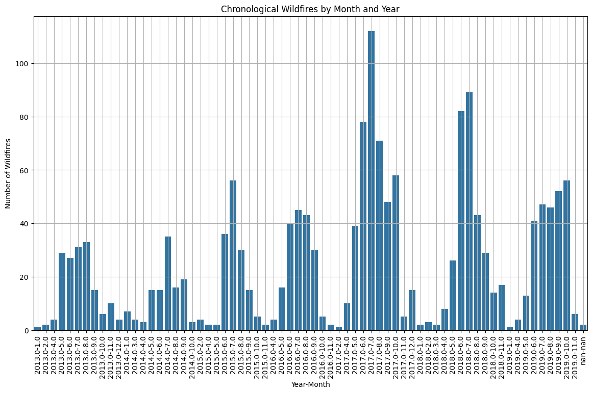
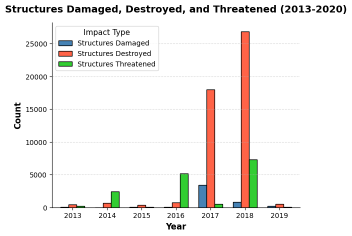
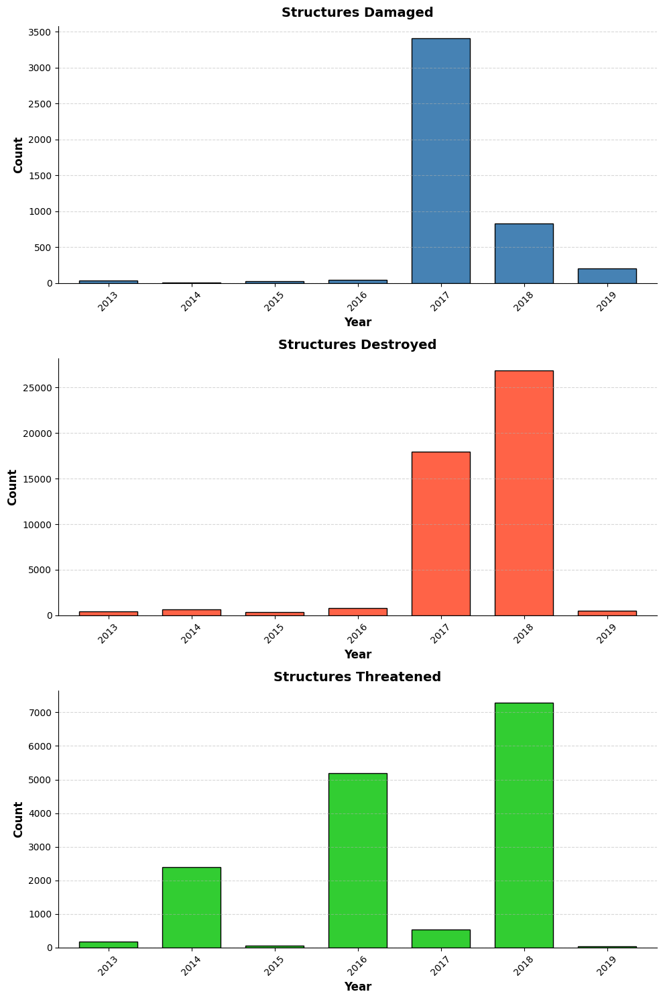
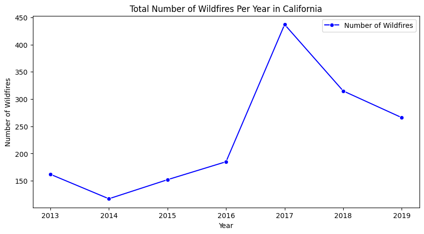
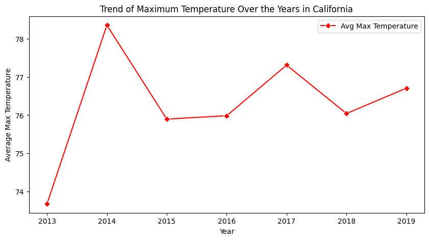
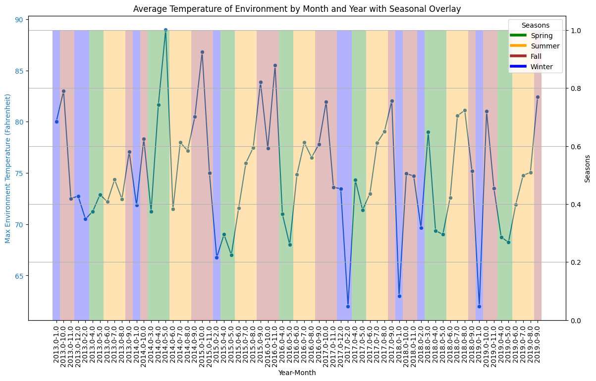
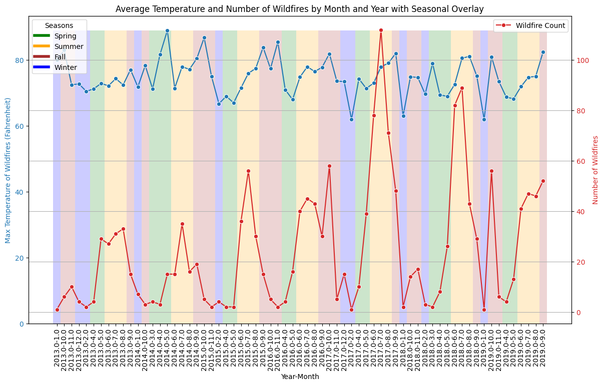
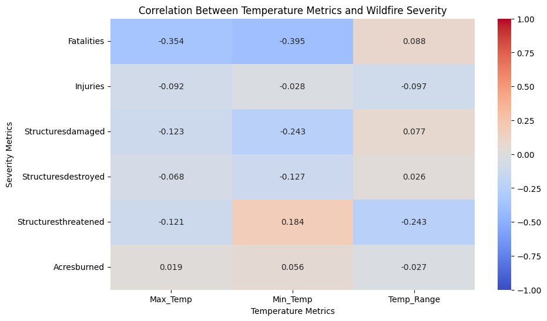

# COGS 108 - Rising Heat, Rising Flames: Examining the Relationship Between Temperature and Wildfire Severity in California (2013–2020)

# Permissions

Place an `X` in the appropriate bracket below to specify if you would like your group's project to be made available to the public. (Note that student names will be included (but PIDs will be scraped from any groups who include their PIDs).

* [ X ] YES - make available
* [  ] NO - keep private

# Names

- Flavia Gabriella Tedjarutjianta
- Jennifer Chang
- Andrew Kim
- Cameron Chen
- Jialin Zhong

# Abstract
Our project explores the correlation between rising average temperatures and the frequency, intensity, and burned area of wildfires in California from 2013 to 2020. By feeding past data on california wildfire statistics into statistical correlation tests and regression models, we were able to measure how exactly temperature trends impacted wildfire severity. Our results were that rising temperatures alone do not strongly predict wildfire severity in terms of fatalities, structures damaged, or acres burned. The weak correlations imply that other factors, such as environmental or human factors, are more likely to have stronger correlations with wildfire severity. 


# Research Question

Are years with higher average temperatures linked to more severe wildfires in California from 2013 to 2020, measured by acres burned and fatalities? This project explores how rising temperatures impact wildfire intensity and what that means for the future.

## Background and Prior Work


California has a long history of devastating wildfires, with incidents becoming more frequent and severe in recent decades. Factors such as prolonged droughts, rising temperatures, and strong winds have created highly flammable conditions, making wildfires more difficult to control. Some of the most destructive fires in history, such as the 2018 Camp Fire—the deadliest in California's history—have resulted in massive property loss and significant financial damage. Historically, wildfire seasons have been influenced by natural cycles, but human activities, including urban expansion and power line failures, have intensified the risks.

The California Wildfire Damage Dataset (2014–Feb 2025) provides key data on recent wildfire incidents, tracking area burned, property damage, fatalities, and financial losses. Previous studies by CAL FIRE and the NIFC 1 <a name="cite_ref-1"></a>[<sup>1</sup>](#cite_note-1)  have linked increasing wildfire severity to climate change and human activity, highlighting the need for better mitigation strategies. By analyzing this dataset, this study aims to identify trends in property loss and financial impact, providing insights to help policymakers and disaster response teams develop more effective prevention and recovery efforts.

Many studies have explored wildfire trends in California, identifying climate change, human activities, and natural ignition sources—such as lightning—as primary factors contributing to increased wildfire frequency and intensity. Climate change and global warming have been shown to exacerbate these conditions, leading to more intense and widespread wildfires. Financial analyses estimate that wildfire damages cost California billions of dollars annually, impacting state and federal disaster relief funds, the insurance industry, and local economies. For instance, the 2020 wildfire season alone resulted in estimated insured losses between 5 billion USD and 9 billion USD. <a name="cite_ref-2"></a>[<sup>2</sup>](#cite_note-2) 

Looking at another study that has been completed by the C2ES (Center for Climate and Energy Solutions), it has been found through research that climate change has been a key factor in increasing the risk and extent of wildfires in the United States. With wildfire risk depending on a number of factors such as temperature, soil moisture, and presence of vegetation, all these factors have a strong direct or indirect ties to climate variability and climate change. Climate change enhances the drying of organic matter in forests, which has subsequently doubled the number of large fires between 1984 and 2015 in the western United States. <a name="cite_ref-3"></a>[<sup>3</sup>](#cite_note-3) While this study looks mainly at the relationship between climate change and the increase and severity in wildfires, we can apply this general knowledge to wildfires in California as well, since the factors for wildfires are consistent despite location. 

In another research study conducted by the California Office of Environmental Health Hazard Assessment (OEHHA), it has been found that in recent years, California has experienced extreme drought intensified by unusually warm temperatures, known as a hotter drought. With hotter
drought came very low precipitation and snowpack, decreased streamflow, dry soils, and large-scale tree deaths. These conditions contributed to an increased risk for extreme wildfires. These extreme wildfires spread easier, burn with greater severity damage to the ecosystem, and are costly to suppress (Crockett and Westerling, 2017). <a name="cite_ref-4"></a>[<sup>4</sup>](#cite_note-4) 

The escalating severity and frequency of wildfires in California are closely linked to rising temperatures and climate change. These events have detrimental financial implications—affecting property owners, insurers, and the broader economy. Thus, while there are a plethora of sources that have analyzed the relationship between temperature levels and wildfire severity, recent wildfires have been extremely rampent and serve as a new set of data to analyze and look into. Analyzing recent data on wildfire damage is crucial for developing more effective mitigation and recovery strategies to address this growing threat.


1. <a name="cite_note-1"></a> [^](#cite_ref-1) U.S. Environmental Protection Agency. (2023). Climate change indicators: Wildfires. Retrieved from https://www.epa.gov/climate-indicators/climate-change-indicators-wildfires.

2. <a name="cite_note-2"></a> [^](#cite_ref-2) Bay Area Council Economic Institute. (2021). The True Cost of Wildfires. Retrieved from https://www.bayareaeconomy.org/report/the-true-cost-of-wildfires/.

3. <a name="cite_note-3"></a> [^](#cite_ref-3) Center for Climate and Energy Solutions. (2020). Wildfires and Climate Change. Retrieved from https://www.c2es.org/content/wildfires-and-climate-change/

4. <a name="cite_note-4"></a> [^](#cite_ref-4) California Office of Environmental Health Hazard Assessment (OEHHA). (2022). Indicators of Climate Change in California - Wildfires. Retrieved from https://oehha.ca.gov/sites/default/files/media/downloads/climate-change/document/04wildfires.pdf


# Hypothesis


We predict that there will be a strong correlation between years with higher average temperatures and the severity of wildfires—measured by the number of acres burned throughout California. However, we acknowledge the amount of acres burned does not measure the impact of wildfires. 

Factors such as structural damage, financial losses, and fatalities can add to the understanding of severity that wildfires cause. While larger fires may not always lead to higher casualties or economic damage, smaller fires in highly populated areas can be more devastating in human and financial terms.

Acknowledging those factors, we hypothesize that the average temperatures will gradually increase as years go on due to climate change and global warming. Rising temperatures consequently will lead to drier vegetation, longer fire seasons, and more intense fires, as shown by studies from various sources. Historical data also links record-breaking heat to some of the most destructive wildfires. Due to this, as the average climate temperatures increase, we predict that the severity and risk of wildfires will also continue to increase, thus, having a positive strong correlation.

# Data

## Data overview

For each dataset include the following information
- Dataset #1
  - Dataset Name: California Weather and Fire Prediction Dataset (1984–2025) with Engineered Features
  - Link to the dataset: https://zenodo.org/records/14712845
  - Number of observations: 2922 
  - Number of variables: 14 
- Dataset #2 
  - Dataset Name: California WildFires (2013-2020)
  - Link to the dataset:  https://www.kaggle.com/datasets/ananthu017/california-wildfire-incidents-20132020
  - Number of observations: 1607
  - Number of variables: 40


- Dataset #1 contains 14 collumns and over 20 thousand rows. The dataset consists of daily maximum and minimum temperatures throughout the years, from 1984 to 2025. The dataset that is importend adn pushed into this project is filtered to only have rows fromo year 2013 to 2020 which is based on the timeframe of the second dataset. This data set will provide hte temperature and other details of the weather condition on the day of the start of the fires that are in hte second dataset. 

- Dataset #2 contains 1636 rows of wildfires that happened in the state of California from 2013 up to 2020. The dataset has 10 collumns that describes the when, the where, the who dealt with the fire, and the resources that was used to contain the fire. This dataset will be the base of this hypothesis, where dataset 1 will follow the information that is needed based on this dataset instead of the other way around.

## Setup
So far, we’ve only utilized one package but have plans to use several packages to help us clean our dataset. Most of the packages can be used in tandem with one another when working with the data to ensure it was properly cleaned, visualized, and analyzed. The first two are pandas and numpy. Pandas helped us to structure our dataset and manipulate our dataset, removing irrelevant rows and columns. Numpy can be used alongside it to take care of mathematical operations like log transformations and dealing with missing values. For dataset visualization, we can use seaborn and matplotlib. Matplotlib will help with the more basic visualizations, allowing us to step back and view the data from a broader perspective while seaborn can provide more specific data comparisons and linear regression visualizations.

## California Weather and Fire Prediction Dataset (1984–2025) with Engineered Features


```python
# imports
import pandas as pd

# load datasets
ca_temp = pd.read_csv('data/Temperature_Cali.csv')
ca_fires = pd.read_csv('data/California_Fire_Incidents.csv')
```


```python
ca_fires.columns
```


    Index(['AcresBurned', 'Active', 'AdminUnit', 'AirTankers', 'ArchiveYear',
           'CalFireIncident', 'CanonicalUrl', 'ConditionStatement',
           'ControlStatement', 'Counties', 'CountyIds', 'CrewsInvolved', 'Dozers',
           'Engines', 'Extinguished', 'Fatalities', 'Featured', 'Final',
           'FuelType', 'Helicopters', 'Injuries', 'Latitude', 'Location',
           'Longitude', 'MajorIncident', 'Name', 'PercentContained',
           'PersonnelInvolved', 'Public', 'SearchDescription', 'SearchKeywords',
           'Started', 'Status', 'StructuresDamaged', 'StructuresDestroyed',
           'StructuresEvacuated', 'StructuresThreatened', 'UniqueId', 'Updated',
           'WaterTenders'],
          dtype='object')


To better merge the dataset, we cleaned both the `Started` column in the ca_fires dataset and the `DATE` column in the ca_fires dataset such that instead of being strings, they are both valid panda datetime objects that follow the format of year-month-day.


```python
# extracted the year, month, date of each fire in the ca_fires dataset
ca_fires['Started'] = pd.to_datetime(ca_fires['Started'].str[0:10])
ca_fires['Started']
```


    0      2013-08-17
    1      2013-05-30
    2      2013-07-15
    3      2013-08-10
    4      2013-05-02
              ...    
    1631   2019-10-10
    1632   2019-06-28
    1633   2019-11-25
    1634   2019-10-22
    1635   2019-10-14
    Name: Started, Length: 1636, dtype: datetime64[ns]


```python
ca_temp['DATE']
```


    0         1/1/13
    1         1/2/13
    2         1/3/13
    3         1/4/13
    4         1/5/13
              ...   
    2917    12/27/20
    2918    12/28/20
    2919    12/29/20
    2920    12/30/20
    2921    12/31/20
    Name: DATE, Length: 2922, dtype: object


```python
# changed the 'DATE' column in the ca_temp df to be a datetime object
ca_temp['DATE'] = pd.to_datetime(ca_temp['DATE'], format='%m/%d/%y')
ca_temp['DATE']
```


    0      2013-01-01
    1      2013-01-02
    2      2013-01-03
    3      2013-01-04
    4      2013-01-05
              ...    
    2917   2020-12-27
    2918   2020-12-28
    2919   2020-12-29
    2920   2020-12-30
    2921   2020-12-31
    Name: DATE, Length: 2922, dtype: datetime64[ns]


We merged the two datasets on date, and we did a left merge because we wanted to add temperatures to all of the fires that were in the ca_fires dataset. Hence, this is why the ca_fires dataframe is the left dataset and the ca_temp is the right dataset. We are ensuring that we don't lose any columns and rows from ca_fires, which proves to be the main data we want to extract information and knowledge from. 

## California WildFires (2013-2020)

Given that the `Started` column in ca_fires and the `DATE` column in ca_temp are both datetime objects, they are now of the same type. Thus, the two datasets can be merged properly on these column.


```python
# merge two datasets on date
df = ca_fires.merge(ca_temp, left_on = 'Started', right_on = 'DATE', how = 'left')
df
```


<div>
<style scoped>
    .dataframe tbody tr th:only-of-type {
        vertical-align: middle;
    }

    .dataframe tbody tr th {
        vertical-align: top;
    }

    .dataframe thead th {
        text-align: right;
    }
</style>
<table border="1" class="dataframe">
  <thead>
    <tr style="text-align: right;">
      <th></th>
      <th>AcresBurned</th>
      <th>Active</th>
      <th>AdminUnit</th>
      <th>AirTankers</th>
      <th>ArchiveYear</th>
      <th>CalFireIncident</th>
      <th>CanonicalUrl</th>
      <th>ConditionStatement</th>
      <th>ControlStatement</th>
      <th>Counties</th>
      <th>...</th>
      <th>AVG_WIND_SPEED</th>
      <th>FIRE_START_DAY</th>
      <th>YEAR</th>
      <th>TEMP_RANGE</th>
      <th>WIND_TEMP_RATIO</th>
      <th>MONTH</th>
      <th>SEASON</th>
      <th>LAGGED_PRECIPITATION</th>
      <th>LAGGED_AVG_WIND_SPEED</th>
      <th>DAY_OF_YEAR</th>
    </tr>
  </thead>
  <tbody>
    <tr>
      <th>0</th>
      <td>257314.0</td>
      <td>False</td>
      <td>Stanislaus National Forest/Yosemite National Park</td>
      <td>NaN</td>
      <td>2013</td>
      <td>True</td>
      <td>/incidents/2013/8/17/rim-fire/</td>
      <td>NaN</td>
      <td>NaN</td>
      <td>Tuolumne</td>
      <td>...</td>
      <td>7.83</td>
      <td>True</td>
      <td>2013.0</td>
      <td>9.0</td>
      <td>0.110282</td>
      <td>8.0</td>
      <td>Summer</td>
      <td>0.00</td>
      <td>6.870000</td>
      <td>229.0</td>
    </tr>
    <tr>
      <th>1</th>
      <td>30274.0</td>
      <td>False</td>
      <td>USFS Angeles National Forest/Los Angeles Count...</td>
      <td>NaN</td>
      <td>2013</td>
      <td>True</td>
      <td>/incidents/2013/5/30/powerhouse-fire/</td>
      <td>NaN</td>
      <td>NaN</td>
      <td>Los Angeles</td>
      <td>...</td>
      <td>6.71</td>
      <td>True</td>
      <td>2013.0</td>
      <td>11.0</td>
      <td>0.089467</td>
      <td>5.0</td>
      <td>Spring</td>
      <td>0.00</td>
      <td>8.052857</td>
      <td>150.0</td>
    </tr>
    <tr>
      <th>2</th>
      <td>27531.0</td>
      <td>False</td>
      <td>CAL FIRE Riverside Unit / San Bernardino Natio...</td>
      <td>NaN</td>
      <td>2013</td>
      <td>True</td>
      <td>/incidents/2013/7/15/mountain-fire/</td>
      <td>NaN</td>
      <td>NaN</td>
      <td>Riverside</td>
      <td>...</td>
      <td>8.28</td>
      <td>True</td>
      <td>2013.0</td>
      <td>11.0</td>
      <td>0.110400</td>
      <td>7.0</td>
      <td>Summer</td>
      <td>0.00</td>
      <td>6.455714</td>
      <td>196.0</td>
    </tr>
    <tr>
      <th>3</th>
      <td>27440.0</td>
      <td>False</td>
      <td>Tahoe National Forest</td>
      <td>NaN</td>
      <td>2013</td>
      <td>False</td>
      <td>/incidents/2013/8/10/american-fire/</td>
      <td>NaN</td>
      <td>NaN</td>
      <td>Placer</td>
      <td>...</td>
      <td>7.61</td>
      <td>True</td>
      <td>2013.0</td>
      <td>10.0</td>
      <td>0.105694</td>
      <td>8.0</td>
      <td>Summer</td>
      <td>0.00</td>
      <td>7.862857</td>
      <td>222.0</td>
    </tr>
    <tr>
      <th>4</th>
      <td>24251.0</td>
      <td>False</td>
      <td>Ventura County Fire/CAL FIRE</td>
      <td>NaN</td>
      <td>2013</td>
      <td>True</td>
      <td>/incidents/2013/5/2/springs-fire/</td>
      <td>Acreage has been reduced based upon more accur...</td>
      <td>NaN</td>
      <td>Ventura</td>
      <td>...</td>
      <td>7.16</td>
      <td>True</td>
      <td>2013.0</td>
      <td>20.0</td>
      <td>0.091795</td>
      <td>5.0</td>
      <td>Spring</td>
      <td>0.00</td>
      <td>7.095714</td>
      <td>122.0</td>
    </tr>
    <tr>
      <th>...</th>
      <td>...</td>
      <td>...</td>
      <td>...</td>
      <td>...</td>
      <td>...</td>
      <td>...</td>
      <td>...</td>
      <td>...</td>
      <td>...</td>
      <td>...</td>
      <td>...</td>
      <td>...</td>
      <td>...</td>
      <td>...</td>
      <td>...</td>
      <td>...</td>
      <td>...</td>
      <td>...</td>
      <td>...</td>
      <td>...</td>
      <td>...</td>
    </tr>
    <tr>
      <th>1631</th>
      <td>9.0</td>
      <td>False</td>
      <td>CAL FIRE / Riverside County Fire</td>
      <td>NaN</td>
      <td>2019</td>
      <td>True</td>
      <td>/incidents/2019/10/10/eagle-fire/</td>
      <td>NaN</td>
      <td>NaN</td>
      <td>Riverside</td>
      <td>...</td>
      <td>5.82</td>
      <td>True</td>
      <td>2019.0</td>
      <td>14.0</td>
      <td>0.074615</td>
      <td>10.0</td>
      <td>Fall</td>
      <td>0.00</td>
      <td>5.784286</td>
      <td>283.0</td>
    </tr>
    <tr>
      <th>1632</th>
      <td>2.0</td>
      <td>False</td>
      <td>CAL FIRE Nevada-Yuba-Placer Unit</td>
      <td>NaN</td>
      <td>2019</td>
      <td>True</td>
      <td>/incidents/2019/6/28/long-fire/</td>
      <td>NaN</td>
      <td>NaN</td>
      <td>Nevada</td>
      <td>...</td>
      <td>7.83</td>
      <td>True</td>
      <td>2019.0</td>
      <td>10.0</td>
      <td>0.107260</td>
      <td>6.0</td>
      <td>Summer</td>
      <td>0.00</td>
      <td>8.691429</td>
      <td>179.0</td>
    </tr>
    <tr>
      <th>1633</th>
      <td>NaN</td>
      <td>False</td>
      <td>Yolo County Fire Protection District</td>
      <td>NaN</td>
      <td>2019</td>
      <td>False</td>
      <td>/incidents/2019/11/25/cashe-fire/</td>
      <td>NaN</td>
      <td>NaN</td>
      <td>Yolo</td>
      <td>...</td>
      <td>7.61</td>
      <td>True</td>
      <td>2019.0</td>
      <td>19.0</td>
      <td>0.108714</td>
      <td>11.0</td>
      <td>Fall</td>
      <td>0.37</td>
      <td>7.157143</td>
      <td>329.0</td>
    </tr>
    <tr>
      <th>1634</th>
      <td>NaN</td>
      <td>False</td>
      <td>Camp Pendleton Marine Corps Base</td>
      <td>NaN</td>
      <td>2019</td>
      <td>False</td>
      <td>/incidents/2019/10/22/oak-fire/</td>
      <td>NaN</td>
      <td>NaN</td>
      <td>San Diego</td>
      <td>...</td>
      <td>5.82</td>
      <td>False</td>
      <td>2019.0</td>
      <td>30.0</td>
      <td>0.060625</td>
      <td>10.0</td>
      <td>Fall</td>
      <td>0.00</td>
      <td>6.392857</td>
      <td>295.0</td>
    </tr>
    <tr>
      <th>1635</th>
      <td>NaN</td>
      <td>False</td>
      <td>Bureau of Indian Affairs</td>
      <td>NaN</td>
      <td>2019</td>
      <td>False</td>
      <td>/incidents/2019/10/14/johnson-fire/</td>
      <td>As of 10:00 p.m. on 10/16, the fire is 90% con...</td>
      <td>NaN</td>
      <td>Riverside</td>
      <td>...</td>
      <td>7.61</td>
      <td>False</td>
      <td>2019.0</td>
      <td>10.0</td>
      <td>0.105694</td>
      <td>10.0</td>
      <td>Fall</td>
      <td>0.00</td>
      <td>6.138571</td>
      <td>287.0</td>
    </tr>
  </tbody>
</table>
<p>1636 rows × 54 columns</p>
</div>


```python
# Adjusted all column titles to be capitalized for cleaner visability
df.columns = [col.title() for col in df.columns]
df.columns
```


    Index(['Acresburned', 'Active', 'Adminunit', 'Airtankers', 'Archiveyear',
           'Calfireincident', 'Canonicalurl', 'Conditionstatement',
           'Controlstatement', 'Counties', 'Countyids', 'Crewsinvolved', 'Dozers',
           'Engines', 'Extinguished', 'Fatalities', 'Featured', 'Final',
           'Fueltype', 'Helicopters', 'Injuries', 'Latitude', 'Location',
           'Longitude', 'Majorincident', 'Name', 'Percentcontained',
           'Personnelinvolved', 'Public', 'Searchdescription', 'Searchkeywords',
           'Started', 'Status', 'Structuresdamaged', 'Structuresdestroyed',
           'Structuresevacuated', 'Structuresthreatened', 'Uniqueid', 'Updated',
           'Watertenders', 'Date', 'Precipitation', 'Max_Temp', 'Min_Temp',
           'Avg_Wind_Speed', 'Fire_Start_Day', 'Year', 'Temp_Range',
           'Wind_Temp_Ratio', 'Month', 'Season', 'Lagged_Precipitation',
           'Lagged_Avg_Wind_Speed', 'Day_Of_Year'],
          dtype='object')


#### We want to cut down our merged dataframe such that we only keep the columns that are of use to us and provide necessary and useful information to our analysis. 

Below Columns Were Kept Due to Relevance to Our Hypothesis and Question: \
`Active`, `Counties`, `Extinguished`, `Fatalities`, `Injuries`, `Majorincident`, `Name`, `Personnelinvolved`, `Started`, `Structuresdamaged`, `Structuresdestroyed`, `Structuresthreatened`, `Uniqueid`, `Date`, `Precipitation`, `Max_Temp`, `Min_Temp`, `Avg_Wind_Speed`, `Year`, `Temp_Range`, `Wind_Temp_Ratio`, `Month`, `Season`, `Lagged_Precipitation`, `Lagged_Avg_Wind_Speed`

Below Columns Were Dropped Due to Irrelevance to Our Hypothesis and Question: \
`Adminunit`, `Airtankers`, `Archiveyear`, `Calfireincident`, `Canonicalurl`, `Conditionstatement`, `Crewsinvolved`, `Dozers`, `Engines`, `Featured`, `Final`, `Fueltype`, `Helicopters`, `Latitude`, `Location`, `Longitude`, `Public`, `Searchdescription`, `Status`, `Searchkeywords`, `Structuresevacuated`, `Updated`, `Watertenders`, `Fire_Start_Day`, `Day_Of_Year`


```python
cols_to_drop = ['Active', 'Adminunit', 'Airtankers', 'Archiveyear',
       'Calfireincident', 'Canonicalurl', 'Conditionstatement',
       'Controlstatement', 'Countyids', 'Crewsinvolved', 'Dozers',
       'Engines','Featured', 'Final',
       'Fueltype', 'Helicopters', 'Latitude', 'Location',
       'Longitude', 'Percentcontained', 'Public', 'Searchdescription', 'Searchkeywords', 'Status',
       'Structuresevacuated', 'Updated',
       'Watertenders', 'Fire_Start_Day', 'Day_Of_Year']

df = df.drop(columns=cols_to_drop)
df
```


<div>
<style scoped>
    .dataframe tbody tr th:only-of-type {
        vertical-align: middle;
    }

    .dataframe tbody tr th {
        vertical-align: top;
    }

    .dataframe thead th {
        text-align: right;
    }
</style>
<table border="1" class="dataframe">
  <thead>
    <tr style="text-align: right;">
      <th></th>
      <th>Acresburned</th>
      <th>Counties</th>
      <th>Extinguished</th>
      <th>Fatalities</th>
      <th>Injuries</th>
      <th>Majorincident</th>
      <th>Name</th>
      <th>Personnelinvolved</th>
      <th>Started</th>
      <th>Structuresdamaged</th>
      <th>...</th>
      <th>Max_Temp</th>
      <th>Min_Temp</th>
      <th>Avg_Wind_Speed</th>
      <th>Year</th>
      <th>Temp_Range</th>
      <th>Wind_Temp_Ratio</th>
      <th>Month</th>
      <th>Season</th>
      <th>Lagged_Precipitation</th>
      <th>Lagged_Avg_Wind_Speed</th>
    </tr>
  </thead>
  <tbody>
    <tr>
      <th>0</th>
      <td>257314.0</td>
      <td>Tuolumne</td>
      <td>2013-09-06T18:30:00Z</td>
      <td>NaN</td>
      <td>NaN</td>
      <td>False</td>
      <td>Rim Fire</td>
      <td>NaN</td>
      <td>2013-08-17</td>
      <td>NaN</td>
      <td>...</td>
      <td>71.0</td>
      <td>62.0</td>
      <td>7.83</td>
      <td>2013.0</td>
      <td>9.0</td>
      <td>0.110282</td>
      <td>8.0</td>
      <td>Summer</td>
      <td>0.00</td>
      <td>6.870000</td>
    </tr>
    <tr>
      <th>1</th>
      <td>30274.0</td>
      <td>Los Angeles</td>
      <td>2013-06-08T18:30:00Z</td>
      <td>NaN</td>
      <td>NaN</td>
      <td>False</td>
      <td>Powerhouse Fire</td>
      <td>NaN</td>
      <td>2013-05-30</td>
      <td>NaN</td>
      <td>...</td>
      <td>75.0</td>
      <td>64.0</td>
      <td>6.71</td>
      <td>2013.0</td>
      <td>11.0</td>
      <td>0.089467</td>
      <td>5.0</td>
      <td>Spring</td>
      <td>0.00</td>
      <td>8.052857</td>
    </tr>
    <tr>
      <th>2</th>
      <td>27531.0</td>
      <td>Riverside</td>
      <td>2013-07-30T18:00:00Z</td>
      <td>NaN</td>
      <td>NaN</td>
      <td>False</td>
      <td>Mountain Fire</td>
      <td>NaN</td>
      <td>2013-07-15</td>
      <td>NaN</td>
      <td>...</td>
      <td>75.0</td>
      <td>64.0</td>
      <td>8.28</td>
      <td>2013.0</td>
      <td>11.0</td>
      <td>0.110400</td>
      <td>7.0</td>
      <td>Summer</td>
      <td>0.00</td>
      <td>6.455714</td>
    </tr>
    <tr>
      <th>3</th>
      <td>27440.0</td>
      <td>Placer</td>
      <td>2013-08-30T08:00:00Z</td>
      <td>NaN</td>
      <td>NaN</td>
      <td>False</td>
      <td>American Fire</td>
      <td>NaN</td>
      <td>2013-08-10</td>
      <td>NaN</td>
      <td>...</td>
      <td>72.0</td>
      <td>62.0</td>
      <td>7.61</td>
      <td>2013.0</td>
      <td>10.0</td>
      <td>0.105694</td>
      <td>8.0</td>
      <td>Summer</td>
      <td>0.00</td>
      <td>7.862857</td>
    </tr>
    <tr>
      <th>4</th>
      <td>24251.0</td>
      <td>Ventura</td>
      <td>2013-05-11T06:30:00Z</td>
      <td>NaN</td>
      <td>10.0</td>
      <td>True</td>
      <td>Springs Fire</td>
      <td>2167.0</td>
      <td>2013-05-02</td>
      <td>6.0</td>
      <td>...</td>
      <td>78.0</td>
      <td>58.0</td>
      <td>7.16</td>
      <td>2013.0</td>
      <td>20.0</td>
      <td>0.091795</td>
      <td>5.0</td>
      <td>Spring</td>
      <td>0.00</td>
      <td>7.095714</td>
    </tr>
    <tr>
      <th>...</th>
      <td>...</td>
      <td>...</td>
      <td>...</td>
      <td>...</td>
      <td>...</td>
      <td>...</td>
      <td>...</td>
      <td>...</td>
      <td>...</td>
      <td>...</td>
      <td>...</td>
      <td>...</td>
      <td>...</td>
      <td>...</td>
      <td>...</td>
      <td>...</td>
      <td>...</td>
      <td>...</td>
      <td>...</td>
      <td>...</td>
      <td>...</td>
    </tr>
    <tr>
      <th>1631</th>
      <td>9.0</td>
      <td>Riverside</td>
      <td>2019-10-10T18:11:00Z</td>
      <td>NaN</td>
      <td>NaN</td>
      <td>False</td>
      <td>Eagle Fire</td>
      <td>NaN</td>
      <td>2019-10-10</td>
      <td>NaN</td>
      <td>...</td>
      <td>78.0</td>
      <td>64.0</td>
      <td>5.82</td>
      <td>2019.0</td>
      <td>14.0</td>
      <td>0.074615</td>
      <td>10.0</td>
      <td>Fall</td>
      <td>0.00</td>
      <td>5.784286</td>
    </tr>
    <tr>
      <th>1632</th>
      <td>2.0</td>
      <td>Nevada</td>
      <td>2019-06-28T17:33:00Z</td>
      <td>NaN</td>
      <td>NaN</td>
      <td>False</td>
      <td>Long Fire</td>
      <td>NaN</td>
      <td>2019-06-28</td>
      <td>NaN</td>
      <td>...</td>
      <td>73.0</td>
      <td>63.0</td>
      <td>7.83</td>
      <td>2019.0</td>
      <td>10.0</td>
      <td>0.107260</td>
      <td>6.0</td>
      <td>Summer</td>
      <td>0.00</td>
      <td>8.691429</td>
    </tr>
    <tr>
      <th>1633</th>
      <td>NaN</td>
      <td>Yolo</td>
      <td>NaN</td>
      <td>NaN</td>
      <td>NaN</td>
      <td>False</td>
      <td>Cashe Fire</td>
      <td>NaN</td>
      <td>2019-11-25</td>
      <td>NaN</td>
      <td>...</td>
      <td>70.0</td>
      <td>51.0</td>
      <td>7.61</td>
      <td>2019.0</td>
      <td>19.0</td>
      <td>0.108714</td>
      <td>11.0</td>
      <td>Fall</td>
      <td>0.37</td>
      <td>7.157143</td>
    </tr>
    <tr>
      <th>1634</th>
      <td>NaN</td>
      <td>San Diego</td>
      <td>NaN</td>
      <td>NaN</td>
      <td>NaN</td>
      <td>False</td>
      <td>Oak Fire</td>
      <td>NaN</td>
      <td>2019-10-22</td>
      <td>NaN</td>
      <td>...</td>
      <td>96.0</td>
      <td>66.0</td>
      <td>5.82</td>
      <td>2019.0</td>
      <td>30.0</td>
      <td>0.060625</td>
      <td>10.0</td>
      <td>Fall</td>
      <td>0.00</td>
      <td>6.392857</td>
    </tr>
    <tr>
      <th>1635</th>
      <td>NaN</td>
      <td>Riverside</td>
      <td>NaN</td>
      <td>NaN</td>
      <td>NaN</td>
      <td>False</td>
      <td>Johnson Fire</td>
      <td>NaN</td>
      <td>2019-10-14</td>
      <td>NaN</td>
      <td>...</td>
      <td>72.0</td>
      <td>62.0</td>
      <td>7.61</td>
      <td>2019.0</td>
      <td>10.0</td>
      <td>0.105694</td>
      <td>10.0</td>
      <td>Fall</td>
      <td>0.00</td>
      <td>6.138571</td>
    </tr>
  </tbody>
</table>
<p>1636 rows × 25 columns</p>
</div>


```python
df['Extinguished'] = pd.to_datetime(df['Extinguished'].str[0:10])
df['Extinguished']
```


    0      2013-09-06
    1      2013-06-08
    2      2013-07-30
    3      2013-08-30
    4      2013-05-11
              ...    
    1631   2019-10-10
    1632   2019-06-28
    1633          NaT
    1634          NaT
    1635          NaT
    Name: Extinguished, Length: 1636, dtype: datetime64[ns]


```python
df
```


<div>
<style scoped>
    .dataframe tbody tr th:only-of-type {
        vertical-align: middle;
    }

    .dataframe tbody tr th {
        vertical-align: top;
    }

    .dataframe thead th {
        text-align: right;
    }
</style>
<table border="1" class="dataframe">
  <thead>
    <tr style="text-align: right;">
      <th></th>
      <th>Acresburned</th>
      <th>Counties</th>
      <th>Extinguished</th>
      <th>Fatalities</th>
      <th>Injuries</th>
      <th>Majorincident</th>
      <th>Name</th>
      <th>Personnelinvolved</th>
      <th>Started</th>
      <th>Structuresdamaged</th>
      <th>...</th>
      <th>Max_Temp</th>
      <th>Min_Temp</th>
      <th>Avg_Wind_Speed</th>
      <th>Year</th>
      <th>Temp_Range</th>
      <th>Wind_Temp_Ratio</th>
      <th>Month</th>
      <th>Season</th>
      <th>Lagged_Precipitation</th>
      <th>Lagged_Avg_Wind_Speed</th>
    </tr>
  </thead>
  <tbody>
    <tr>
      <th>0</th>
      <td>257314.0</td>
      <td>Tuolumne</td>
      <td>2013-09-06</td>
      <td>NaN</td>
      <td>NaN</td>
      <td>False</td>
      <td>Rim Fire</td>
      <td>NaN</td>
      <td>2013-08-17</td>
      <td>NaN</td>
      <td>...</td>
      <td>71.0</td>
      <td>62.0</td>
      <td>7.83</td>
      <td>2013.0</td>
      <td>9.0</td>
      <td>0.110282</td>
      <td>8.0</td>
      <td>Summer</td>
      <td>0.00</td>
      <td>6.870000</td>
    </tr>
    <tr>
      <th>1</th>
      <td>30274.0</td>
      <td>Los Angeles</td>
      <td>2013-06-08</td>
      <td>NaN</td>
      <td>NaN</td>
      <td>False</td>
      <td>Powerhouse Fire</td>
      <td>NaN</td>
      <td>2013-05-30</td>
      <td>NaN</td>
      <td>...</td>
      <td>75.0</td>
      <td>64.0</td>
      <td>6.71</td>
      <td>2013.0</td>
      <td>11.0</td>
      <td>0.089467</td>
      <td>5.0</td>
      <td>Spring</td>
      <td>0.00</td>
      <td>8.052857</td>
    </tr>
    <tr>
      <th>2</th>
      <td>27531.0</td>
      <td>Riverside</td>
      <td>2013-07-30</td>
      <td>NaN</td>
      <td>NaN</td>
      <td>False</td>
      <td>Mountain Fire</td>
      <td>NaN</td>
      <td>2013-07-15</td>
      <td>NaN</td>
      <td>...</td>
      <td>75.0</td>
      <td>64.0</td>
      <td>8.28</td>
      <td>2013.0</td>
      <td>11.0</td>
      <td>0.110400</td>
      <td>7.0</td>
      <td>Summer</td>
      <td>0.00</td>
      <td>6.455714</td>
    </tr>
    <tr>
      <th>3</th>
      <td>27440.0</td>
      <td>Placer</td>
      <td>2013-08-30</td>
      <td>NaN</td>
      <td>NaN</td>
      <td>False</td>
      <td>American Fire</td>
      <td>NaN</td>
      <td>2013-08-10</td>
      <td>NaN</td>
      <td>...</td>
      <td>72.0</td>
      <td>62.0</td>
      <td>7.61</td>
      <td>2013.0</td>
      <td>10.0</td>
      <td>0.105694</td>
      <td>8.0</td>
      <td>Summer</td>
      <td>0.00</td>
      <td>7.862857</td>
    </tr>
    <tr>
      <th>4</th>
      <td>24251.0</td>
      <td>Ventura</td>
      <td>2013-05-11</td>
      <td>NaN</td>
      <td>10.0</td>
      <td>True</td>
      <td>Springs Fire</td>
      <td>2167.0</td>
      <td>2013-05-02</td>
      <td>6.0</td>
      <td>...</td>
      <td>78.0</td>
      <td>58.0</td>
      <td>7.16</td>
      <td>2013.0</td>
      <td>20.0</td>
      <td>0.091795</td>
      <td>5.0</td>
      <td>Spring</td>
      <td>0.00</td>
      <td>7.095714</td>
    </tr>
    <tr>
      <th>...</th>
      <td>...</td>
      <td>...</td>
      <td>...</td>
      <td>...</td>
      <td>...</td>
      <td>...</td>
      <td>...</td>
      <td>...</td>
      <td>...</td>
      <td>...</td>
      <td>...</td>
      <td>...</td>
      <td>...</td>
      <td>...</td>
      <td>...</td>
      <td>...</td>
      <td>...</td>
      <td>...</td>
      <td>...</td>
      <td>...</td>
      <td>...</td>
    </tr>
    <tr>
      <th>1631</th>
      <td>9.0</td>
      <td>Riverside</td>
      <td>2019-10-10</td>
      <td>NaN</td>
      <td>NaN</td>
      <td>False</td>
      <td>Eagle Fire</td>
      <td>NaN</td>
      <td>2019-10-10</td>
      <td>NaN</td>
      <td>...</td>
      <td>78.0</td>
      <td>64.0</td>
      <td>5.82</td>
      <td>2019.0</td>
      <td>14.0</td>
      <td>0.074615</td>
      <td>10.0</td>
      <td>Fall</td>
      <td>0.00</td>
      <td>5.784286</td>
    </tr>
    <tr>
      <th>1632</th>
      <td>2.0</td>
      <td>Nevada</td>
      <td>2019-06-28</td>
      <td>NaN</td>
      <td>NaN</td>
      <td>False</td>
      <td>Long Fire</td>
      <td>NaN</td>
      <td>2019-06-28</td>
      <td>NaN</td>
      <td>...</td>
      <td>73.0</td>
      <td>63.0</td>
      <td>7.83</td>
      <td>2019.0</td>
      <td>10.0</td>
      <td>0.107260</td>
      <td>6.0</td>
      <td>Summer</td>
      <td>0.00</td>
      <td>8.691429</td>
    </tr>
    <tr>
      <th>1633</th>
      <td>NaN</td>
      <td>Yolo</td>
      <td>NaT</td>
      <td>NaN</td>
      <td>NaN</td>
      <td>False</td>
      <td>Cashe Fire</td>
      <td>NaN</td>
      <td>2019-11-25</td>
      <td>NaN</td>
      <td>...</td>
      <td>70.0</td>
      <td>51.0</td>
      <td>7.61</td>
      <td>2019.0</td>
      <td>19.0</td>
      <td>0.108714</td>
      <td>11.0</td>
      <td>Fall</td>
      <td>0.37</td>
      <td>7.157143</td>
    </tr>
    <tr>
      <th>1634</th>
      <td>NaN</td>
      <td>San Diego</td>
      <td>NaT</td>
      <td>NaN</td>
      <td>NaN</td>
      <td>False</td>
      <td>Oak Fire</td>
      <td>NaN</td>
      <td>2019-10-22</td>
      <td>NaN</td>
      <td>...</td>
      <td>96.0</td>
      <td>66.0</td>
      <td>5.82</td>
      <td>2019.0</td>
      <td>30.0</td>
      <td>0.060625</td>
      <td>10.0</td>
      <td>Fall</td>
      <td>0.00</td>
      <td>6.392857</td>
    </tr>
    <tr>
      <th>1635</th>
      <td>NaN</td>
      <td>Riverside</td>
      <td>NaT</td>
      <td>NaN</td>
      <td>NaN</td>
      <td>False</td>
      <td>Johnson Fire</td>
      <td>NaN</td>
      <td>2019-10-14</td>
      <td>NaN</td>
      <td>...</td>
      <td>72.0</td>
      <td>62.0</td>
      <td>7.61</td>
      <td>2019.0</td>
      <td>10.0</td>
      <td>0.105694</td>
      <td>10.0</td>
      <td>Fall</td>
      <td>0.00</td>
      <td>6.138571</td>
    </tr>
  </tbody>
</table>
<p>1636 rows × 25 columns</p>
</div>


# Results

## Exploratory Data Analysis

### Section 1 of EDA - please give it a better title than this

Some more words and stuff.  Remember notebooks work best if you interleave the code that generates a result with properly annotate figures and text that puts these results into context.


```python
import matplotlib.pyplot as plt
import seaborn as sns
import plotly as px
```

### EDA Visualization 1: Number of Wildfires and Maximum Temperature Trends in California


```python
# Chronological Wildfires by month and year

# Sort dataframe by Year and Month
df_new = df.sort_values(by=['Year', 'Month'])

# Create a combined 'Year-Month' column for plotting
df_new['Year-Month'] = df_new['Year'].astype(str) + '-' + df_new['Month'].astype(str)

# Plotting graph
plt.figure(figsize=(14, 8))
sns.countplot(x=df_new['Year-Month'], order=df_new['Year-Month'].unique())
plt.xticks(rotation=90)
plt.xlabel('Year-Month')
plt.ylabel('Number of Wildfires')
plt.title('Chronological Wildfires by Month and Year')
plt.grid(True)
plt.show()
```


    

    


#### Description of Visualization 1
Plot analysis for the number of wildfires per month in california.

**Distributions:**\
The number of wildfires per year varies a lot. There is a sharp spike in 2017, followed by a decline in 2018 and 2019. This suggests that
wildfire occurences don't consistently change, but are influenced by other external factors. 

**Outliers:**\
There is a high spike in the 2017 year, where it crossed the 100 mark. After further investigation 2017 is the year where California experienced one of its biggest wildfires. In the beginning of the year California had heavy rainfall but then had a really big switch. <a name="cite_ref-1"></a>[<sup>1</sup>](#cite_note-1)

**Learned:**\
With the cyclical pattern when plotted monthly, there seems to be at least a factor that is affecting these numbers that also has a cyclical pattern.

1. <a name="cite_note-1"></a> [^](#cite_ref-1) Cal Fire. (2017) .2017 Incident Archive . Retrieved from https://www.fire.ca.gov/incidents/2017


### EDA Visualization 2: Distribution Between Structures Damaged, Destroyed, and Threatened


```python
# PLOT 2 
# Aggregate data
structural_data = df.groupby("Year")[["Structuresdamaged", "Structuresdestroyed", "Structuresthreatened"]].sum()

# Convert Year index to integers (fixes x-axis issue)
structural_data.index = structural_data.index.astype(int)

# Rename columns for better legend readability
structural_data = structural_data.rename(columns={
    "Structuresdamaged": "Structures Damaged",
    "Structuresdestroyed": "Structures Destroyed",
    "Structuresthreatened": "Structures Threatened"
})

# Set figure size
plt.figure(figsize=(12, 6))

# Define colors
colors = ["#4682B4", "#FF6347", "#32CD32"]  # Blue, Red, Green

# Plot grouped bar chart
structural_data.plot(kind="bar", color=colors, width=0.7, edgecolor="black")

# Improve aesthetics
plt.xlabel("Year", fontsize=12, fontweight="bold")
plt.ylabel("Count", fontsize=12, fontweight="bold")
plt.title("Structures Damaged, Destroyed, and Threatened (2013-2020)", fontsize=14, fontweight="bold", pad=15)
plt.legend(title="Impact Type", fontsize=10, title_fontsize=11)
plt.xticks(rotation=0, fontsize=10)  # Rotate labels for clarity
plt.yticks(fontsize=10)
plt.grid(axis="y", linestyle="--", alpha=0.5)
sns.despine()

# Show plot
plt.show()
```


    <Figure size 1200x600 with 0 Axes>


    

    


Looking at this grouped bar chart we made analyzing the distributions between the count and year of structures damaged, structures destroyed, and stuctures threatened. We wanted to further look at each distribution individually seeing that the scale on the y-axis of count is heavily impacted by the year 2018 data, specifically the count of structures destroyed. 


```python

# Aggregate data
structural_data = df.groupby("Year")[["Structuresdamaged", "Structuresdestroyed", "Structuresthreatened"]].sum()

# Convert Year index to integers to fix x-axis labels
structural_data.index = structural_data.index.astype(int)

# Set figure size
fig, axes = plt.subplots(3, 1, figsize=(10, 15))  # 3 separate bar charts in a vertical layout

# Define colors and labels
metrics = {
    "Structuresdamaged": ("Structures Damaged", "#4682B4"),  # Blue
    "Structuresdestroyed": ("Structures Destroyed", "#FF6347"),  # Tomato Red
    "Structuresthreatened": ("Structures Threatened", "#32CD32")  # Green
}

# Loop through each metric and create a separate bar plot
for ax, (col, (title, color)) in zip(axes, metrics.items()):
    structural_data[[col]].plot(kind="bar", color=color, width=0.7, ax=ax, legend=False, edgecolor="black")
    
    ax.set_title(title, fontsize=14, fontweight="bold", pad=10)
    ax.set_xlabel("Year", fontsize=12, fontweight="bold")
    ax.set_ylabel("Count", fontsize=12, fontweight="bold")
    ax.set_xticklabels(structural_data.index, rotation=45, fontsize=10)
    ax.grid(axis="y", linestyle="--", alpha=0.5)

# Improve layout
plt.tight_layout()
sns.despine()

# Show plot
plt.show()
```


    

    


#### Description of Visualization 2
Bar analysis between structures damaged and destroyed, and structures threatened due to wildfires throughout 2013 - 2019 in California.

Distributions - As the years go on, there is a calm relationship of structures damaged and destroyed until 2017, where there was a dramatic spike in numbers of buildings hurt. Moreso, it seems wildfires tend to destroy structures rather than damage them. As for structures threatened, it fluctuates every few years despite the numbers in the structures damaged and destroyed being very low. However, there does not seem to be a direct correlation between wildfires and temperature.

Outliers - Within the structures damaged and destroyed bar plot, 2017 and 2018 are outliers, with an increase in buildings damaged. This could possibly be due to the number of wildfires in California reaching its peak during 2017, seen in the ‘Total Number of Wildfires Per Year in California’. In the structures threatened bar plot, the outliers would be 2014, 2016, and 2018. As for 2018, a cause could be the numerous wildfires that year, causing a lot of structures to be threatened, damaged, or destroyed. For the 2014 and 2016 years, it is currently hard to conclude the reasonings for these outliers.

Relationships: Comparing the trends in the ‘Total Number of Wildfires Per Year in California’ with ‘Structures Damaged & Destroyed (2013 - 2020)’, it could be stated that there is a relationship between number of wildfires and number of structures damaged and destroyed.

Learned - As 2017-2018 were peak fire years, the number of structures and buildings damaged and destroyed had an increase, concluding a relationship between the two. As the study continues, we can see if wind severity plays a role structures damaged.

### EDA Visualization 3: Distribution of Average Wind Speed and Chronological Wildfires by Month & Year


```python
# Plot 1
yearly_stats = df.groupby('Year').agg({
   'Max_Temp': 'mean'
}).reset_index()


yearly_stats['Wildfires_Count'] = df.groupby('Year').size().values


# Plot of the number of wildfires (the blue)
plt.figure(figsize=(10, 5))
sns.lineplot(x=yearly_stats['Year'], y=yearly_stats['Wildfires_Count'], marker='o', color='b', label="Number of Wildfires")
plt.xlabel("Year")
plt.ylabel("Number of Wildfires")
plt.title("Total Number of Wildfires Per Year in California")
plt.legend()
plt.show()
```


    

    


```python
# Plot 2
plt.figure(figsize=(10, 5))
sns.lineplot(x=yearly_stats['Year'], y=yearly_stats['Max_Temp'], marker='D', color='r', label="Avg Max Temperature")
plt.xlabel("Year")
plt.ylabel("Average Max Temperature")
plt.title("Trend of Maximum Temperature Over the Years in California")
plt.legend()
plt.show()

```


    

    


```python
#Plot 3
# Average wind speed over time plot
plt.figure(figsize=(10, 6))
sns.lineplot(x=df['Year'], y=df['Wind_Temp_Ratio'], marker='o')
plt.xlabel('Year')
plt.ylabel('Wind-Temperature Ratio')
plt.title('Trend of Wind-Temperature Ratio from 2013-2019')
plt.grid(True)
plt.show()
```


    

    


### Description of Visualization 3
Analysis of different trends per year in relation to the wildfires 


**Distributions:**
1. _Total Number of Wildfires Per Year in California_:
For wildfires, the number of wildfires per year varies a lot. There is a sharp spike in 2017, followed by a decline in 2018 and 2019. This suggests that wildfire occurences don't consistently change, but are influenced by other external factors.

2. _Trend of Maximum Temperature Over the Years in California_:
For temperature, the average maximum temperature per year fluctuates, with a notable spike in 2014, which eventually leveled out to around 76 to 77 starting from 2015. The distribution does not follow a clear upward linear trend but shows yearly fluctuations.


3. _Trend of Wind-Temperatre Ratio from 2013-2019_:
From 2013 to 2016, the average wind shows a consistent somewhat linear increasing trend from 7.2 to about 7.95 mph. However from 2016 until 2019, the average wind fluctuates multiple times going from 7.6 mph back up to 7.9 mph and then finally settling back at 7.45 mph. 


**Outliers:**
1. _Trend of Maximum Temperature Over the Years in California_:
For temperature, given the scope of the graph, 2014 could potentially stand out as an outlier because it shows a sudden spike in temperature compared to other years. However it's worth noting that if we had a longer time range, it might show otherwise.

2. _Total Number of Wildfires Per Year in California_:
For wildfires, 2017 is a pretty significant wildire- it jumped from around 175 in 2016 to almost 450 in 2017. This also implies that temperature changes aren't consistent, it varies and with each variation by a lot.

3. _Trend of Wind-Temperatre Ratio from 2013-2019_:
For the average wind graphs, there’s a chance that 2017 is an outlier due to it being a sudden sharp drop following an increasing trend. Not only that but 2018, the following year, has average wind speeds similar to 2016 suggesting that 2017 was an irregularity.

**Learned:**\
All graphs has either a dip or a spike in 2017, where the wind-temperature ratio has a dip and there's an increase in the number of wildfires that year and also the temperature. A similar pattern is also seen in 2014, but the number of wildfires in this case decreases instead of spikes. General trends have a similar pattern of movement, which will be worth noting down for the analysis going further down.

## Correlation Analysis Between Temperatures and Number of Wildfires

As the first step of answering our research question we wanted to see if the  cyclical monthly average of the numbers of wildfires has a similar shape with the average maximum temperatures when these wildfires happen. Hence, if we see a similar pattern between the two, there may be a strong correlation between the number of wildfires and high temperatures.

With this we start by plotting only the average maximum temperature per month over the years and also see in which seasons it corresponds to. 


```python
# Chronological Wildfires by month and year (Average Temperature and Season)

# Sort dataframe by Year and Month
df_new = df.sort_values(by=['Year', 'Month'])

# Create a combined 'Year-Month' column for plotting
df_new['Year-Month'] = df_new['Year'].astype(str) + '-' + df_new['Month'].astype(str)

# Group by 'Year-Month' and calculate the average Max_Temp for each group
df_avg_temp = df_new.groupby(['Year-Month', 'Season'])['Max_Temp'].mean().reset_index()

# Create two subplots: one for the temperature line plot and one for the seasons
fig, ax1 = plt.subplots(figsize=(14, 8))

# Plot the line plot for Max_Temp without grouping by Season
sns.lineplot(x='Year-Month', y='Max_Temp', data=df_avg_temp, ax=ax1, marker='o', color='tab:blue')

# Label the y-axis for temperature
ax1.set_xlabel('Year-Month')
ax1.set_ylabel('Max Environment Temperature (Fahrenheit)', color='tab:blue')
ax1.tick_params(axis='y', labelcolor='tab:blue')
ax1.set_title('Average Temperature of Environment by Month and Year with Seasonal Overlay')
plt.xticks(rotation=90)

# Create a second y-axis for the seasons
ax2 = ax1.twinx()

# Plot the seasonality using a bar plot for better visualization of seasons
season_colors = {'Spring': 'green', 'Summer': 'orange', 'Fall': 'brown', 'Winter': 'blue'}
season_map = df_avg_temp['Season'].map(season_colors)
ax2.bar(df_avg_temp['Year-Month'], [1] * len(df_avg_temp), color=season_map, alpha=0.3, width=1.0)

# Label the second y-axis for season visualization
ax2.set_ylabel('Seasons', color='black')
ax2.tick_params(axis='y', labelcolor='black')

# Add a legend for the seasons
season_patches = [plt.Line2D([0], [0], color=color, lw=4) for color in season_colors.values()]
ax2.legend(season_patches, season_colors.keys(), title='Seasons', loc='upper right')

# Display grid and show plot
plt.grid(True)
plt.show()
```


    

    


From the graph, there are a lot of spikes and different seasons of the year as well but especially those in spring, summer, and fall. If it was true that there is a strong correlation between the high temperatures and number of wildfires then we should see a spike of wildfires when this temperature fluctuates as well.\
Next, we will plot both the average maximum temperature and the number of wildfires per month into one graph to see if there are similarities between the patterns of these two things. 


```python
# Chronological Wildfires by month and year (Average Temperature, Number of Wildfires, and Season)

from scipy.stats import pearsonr

# Sort dataframe by Year and Month
df_new = df.sort_values(by=['Year', 'Month'])

# Create a combined 'Year-Month' column for plotting
df_new['Year-Month'] = df_new['Year'].astype(str) + '-' + df_new['Month'].astype(str)

# Group by 'Year-Month' and calculate the average Max_Temp and count of wildfires
df_agg = df_new.groupby(['Year-Month', 'Season']).agg(
    Max_Temp=('Max_Temp', 'mean'),
    Wildfire_Count=('Max_Temp', 'size')  # Count of wildfires per Year-Month
).reset_index()

# Create two subplots: one for the temperature line plot and one for the seasons
fig, ax1 = plt.subplots(figsize=(14, 8))

# Plot the line plot for Max_Temp without grouping by Season
sns.lineplot(x='Year-Month', y='Max_Temp', data=df_agg, ax=ax1, marker='o', color='tab:blue', label='Max Temp')

# Label the y-axis for temperature
ax1.set_xlabel('Year-Month')
ax1.set_ylabel('Max Temperature of Wildfires (Fahrenheit)', color='tab:blue')
ax1.tick_params(axis='y', labelcolor='tab:blue')
ax1.set_title('Average Temperature and Number of Wildfires by Month and Year with Seasonal Overlay')
plt.xticks(rotation=90)

# Create a second y-axis for the number of wildfires
ax2 = ax1.twinx()

# Plot the number of wildfires as a line plot
sns.lineplot(x='Year-Month', y='Wildfire_Count', data=df_agg, ax=ax2, marker='o', color='tab:red', label='Wildfire Count')

# Label the second y-axis for wildfire count
ax2.set_ylabel('Number of Wildfires', color='tab:red')
ax2.tick_params(axis='y', labelcolor='tab:red')

# Add seasonality as a bar plot on the background
season_colors = {'Spring': 'green', 'Summer': 'orange', 'Fall': 'brown', 'Winter': 'blue'}
season_map = df_agg['Season'].map(season_colors)
ax1.bar(df_agg['Year-Month'], [max(df_agg['Max_Temp'])] * len(df_agg), color=season_map, alpha=0.2, width=1.0, zorder=0)

# Add a legend for the seasons
season_patches = [plt.Line2D([0], [0], color=color, lw=4) for color in season_colors.values()]
ax1.legend(season_patches, season_colors.keys(), title='Seasons', loc='upper left')

# Display grid and show plot
plt.grid(True)
plt.show()

# Calculate the Pearson correlation coefficient between Max_Temp and Wildfire_Count
correlation, p_value = pearsonr(df_agg['Max_Temp'], df_agg['Wildfire_Count'])

# Print correlation analysis
print("\nCorrelation Analysis:")
print(f"Pearson Correlation Coefficient: {correlation:.3f}")
print(f"P-value: {p_value:.3f}")
if p_value < 0.05:
    print("The correlation is statistically significant (p < 0.05).")
else:
    print("The correlation is not statistically significant (p >= 0.05).")

if abs(correlation) >= 0.7:
    strength = "strong"
elif abs(correlation) >= 0.3:
    strength = "moderate"
else:
    strength = "weak"
print(f"The strength of the correlation is {strength}.")

```


    

    


    
    Correlation Analysis:
    Pearson Correlation Coefficient: 0.271
    P-value: 0.026
    The correlation is statistically significant (p < 0.05).
    The strength of the correlation is weak.


As seen in the graph, the left axis indicates the temperature of the wildfires while the right axis is for the number of wildfires. The main goal of this graph is to see the similarity or differences of the shapes and trends of these two features. There are some parts of the graph that has a similar shape such as from the year 2018 until the end of 2019 we're both temperature and number of wildfires moves in a similar manner. However, from the year of 2013 up until 2017 there isn't a clear similarity of the trend between these two features. We noticed that there is a really high spike of numbers of wildfires in 2017 but that did not correlate with a high spike in the maximum temperature of that month as well. As mentioned in the exploratory data visualization and the previous part, this 2017 Wildfire was one of the biggest that California experienced. 

In order to quantify the relationship between these two aspects, we perform a correlation analysis where we calculated the correlation coefficient that resulted in the value of 0.271 and a p-value of 0.026. However, with this low p-value the strength of the correlation did not come out very strong, which is in line of the graph that we plot it out.


## Correlation Analysis Between Temperatures and Severity of Wildfire
After seeing the overall correlation between seasons, average maximum temperature, and number of wildfires, we wanted to further explore these correlations by analyzing the relationship between temperatures and severity of wildfire. In our analysis, the severity of the wildfire is conditioned on multiple features: `Fatalities`, `Injuries`, `Stucturesdamaged`, `Structuresdestroyed`, `Structuresthreatened`, and `Acresburned`.

With this, our goal of the analysis here was to examine the correlation between different temperature metrics (Max Temp, Min Temp, Temp Range) and various wildfire severity indicators (Fatalities, Injuries, Structures Damaged, Structures Destroyed, Structures Threatened, Acres Burned). By doing so, we aimed to understand whether temperature patterns have a significant relationship with wildfire impact.


```python
# Assuming df is your DataFrame (already loaded with 1636 rows)
# Define temperature-related columns and severity columns
temp_cols = ['Max_Temp', 'Min_Temp', 'Temp_Range']
severity_cols = ['Fatalities', 'Injuries', 'Structuresdamaged', 'Structuresdestroyed', 
                 'Structuresthreatened', 'Acresburned']

# Check if all columns exist in the DataFrame
missing_cols = [col for col in temp_cols + severity_cols if col not in df.columns]
if missing_cols:
    print(f"Error: The following columns are missing from the DataFrame: {missing_cols}")
    raise KeyError("Missing columns in DataFrame")

# Ensure all columns are numeric
df[temp_cols + severity_cols] = df[temp_cols + severity_cols].apply(pd.to_numeric, errors='coerce')

# Debugging: Check initial DataFrame size and missing values
print(f"Original DataFrame rows: {len(df)}")
print("Missing data summary:")
print(df[temp_cols + severity_cols].isna().sum())

# Initialize a dictionary to store correlation results
correlation_results = {}

# Calculate Pearson correlation and p-values for each pair, handling NaNs pairwise
for temp_col in temp_cols:
    correlation_results[temp_col] = {}
    for sev_col in severity_cols:
        # Drop NaNs only for this specific pair
        valid_data = df[[temp_col, sev_col]].dropna()
        print(f"Valid rows for {temp_col} and {sev_col}: {len(valid_data)}")
        if len(valid_data) < 2:
            print(f"Warning: Insufficient data for {temp_col} and {sev_col} (only {len(valid_data)} valid rows)")
            corr, p_val = float('nan'), float('nan')
        else:
            corr, p_val = pearsonr(valid_data[temp_col], valid_data[sev_col])
        correlation_results[temp_col][sev_col] = {'Correlation': corr, 'P-value': p_val}

# Convert results to DataFrames for visualization (fixed the NameError)
corr_df = pd.DataFrame({
    temp_col: {sev_col: correlation_results[temp_col][sev_col]['Correlation'] 
               for sev_col in severity_cols} 
    for temp_col in temp_cols
})
pval_df = pd.DataFrame({
    temp_col: {sev_col: correlation_results[temp_col][sev_col]['P-value'] 
               for sev_col in severity_cols} 
    for temp_col in temp_cols
})

# Plot a heatmap of correlations
plt.figure(figsize=(10, 6))
sns.heatmap(corr_df, annot=True, cmap='coolwarm', center=0, vmin=-1, vmax=1, fmt='.3f')
plt.title('Correlation Between Temperature Metrics and Wildfire Severity')
plt.xlabel('Temperature Metrics')
plt.ylabel('Severity Metrics')
plt.show()

# Print detailed correlation analysis
print("\nCorrelation Analysis Between Temperature Metrics and Wildfire Severity:")
for temp_col in temp_cols:
    print(f"\nCorrelations with {temp_col}:")
    for sev_col in severity_cols:
        corr = correlation_results[temp_col][sev_col]['Correlation']
        p_val = correlation_results[temp_col][sev_col]['P-value']
        if pd.isna(corr):
            print(f"  {sev_col}: Insufficient data (correlation not calculated)")
        else:
            print(f"  {sev_col}:")
            print(f"    Pearson Correlation Coefficient: {corr:.3f}")
            print(f"    P-value: {p_val:.3f}")
            if p_val < 0.05:
                print("    Statistically significant (p < 0.05)")
            else:
                print("    Not statistically significant (p >= 0.05)")
            strength = "strong" if abs(corr) >= 0.7 else "moderate" if abs(corr) >= 0.3 else "weak"
            print(f"    Strength of correlation: {strength}")

# Summary of impactful correlations
print("\nSummary of Impactful Correlations (Statistically Significant and Moderate/Strong):")
for temp_col in temp_cols:
    for sev_col in severity_cols:
        corr = correlation_results[temp_col][sev_col]['Correlation']
        p_val = correlation_results[temp_col][sev_col]['P-value']
        if not pd.isna(corr) and p_val < 0.05 and abs(corr) >= 0.3:
            print(f"{temp_col} and {sev_col}: Correlation = {corr:.3f}, P-value = {p_val:.3f}")
```

    Original DataFrame rows: 1636
    Missing data summary:
    Max_Temp                   2
    Min_Temp                   2
    Temp_Range                 2
    Fatalities              1615
    Injuries                1516
    Structuresdamaged       1569
    Structuresdestroyed     1461
    Structuresthreatened    1606
    Acresburned                3
    dtype: int64
    Valid rows for Max_Temp and Fatalities: 21
    Valid rows for Max_Temp and Injuries: 120
    Valid rows for Max_Temp and Structuresdamaged: 67
    Valid rows for Max_Temp and Structuresdestroyed: 175
    Valid rows for Max_Temp and Structuresthreatened: 30
    Valid rows for Max_Temp and Acresburned: 1631
    Valid rows for Min_Temp and Fatalities: 21
    Valid rows for Min_Temp and Injuries: 120
    Valid rows for Min_Temp and Structuresdamaged: 67
    Valid rows for Min_Temp and Structuresdestroyed: 175
    Valid rows for Min_Temp and Structuresthreatened: 30
    Valid rows for Min_Temp and Acresburned: 1631
    Valid rows for Temp_Range and Fatalities: 21
    Valid rows for Temp_Range and Injuries: 120
    Valid rows for Temp_Range and Structuresdamaged: 67
    Valid rows for Temp_Range and Structuresdestroyed: 175
    Valid rows for Temp_Range and Structuresthreatened: 30
    Valid rows for Temp_Range and Acresburned: 1631


    

    


    
    Correlation Analysis Between Temperature Metrics and Wildfire Severity:
    
    Correlations with Max_Temp:
      Fatalities:
        Pearson Correlation Coefficient: -0.354
        P-value: 0.116
        Not statistically significant (p >= 0.05)
        Strength of correlation: moderate
      Injuries:
        Pearson Correlation Coefficient: -0.092
        P-value: 0.320
        Not statistically significant (p >= 0.05)
        Strength of correlation: weak
      Structuresdamaged:
        Pearson Correlation Coefficient: -0.123
        P-value: 0.320
        Not statistically significant (p >= 0.05)
        Strength of correlation: weak
      Structuresdestroyed:
        Pearson Correlation Coefficient: -0.068
        P-value: 0.369
        Not statistically significant (p >= 0.05)
        Strength of correlation: weak
      Structuresthreatened:
        Pearson Correlation Coefficient: -0.121
        P-value: 0.523
        Not statistically significant (p >= 0.05)
        Strength of correlation: weak
      Acresburned:
        Pearson Correlation Coefficient: 0.019
        P-value: 0.453
        Not statistically significant (p >= 0.05)
        Strength of correlation: weak
    
    Correlations with Min_Temp:
      Fatalities:
        Pearson Correlation Coefficient: -0.395
        P-value: 0.076
        Not statistically significant (p >= 0.05)
        Strength of correlation: moderate
      Injuries:
        Pearson Correlation Coefficient: -0.028
        P-value: 0.765
        Not statistically significant (p >= 0.05)
        Strength of correlation: weak
      Structuresdamaged:
        Pearson Correlation Coefficient: -0.243
        P-value: 0.047
        Statistically significant (p < 0.05)
        Strength of correlation: weak
      Structuresdestroyed:
        Pearson Correlation Coefficient: -0.127
        P-value: 0.095
        Not statistically significant (p >= 0.05)
        Strength of correlation: weak
      Structuresthreatened:
        Pearson Correlation Coefficient: 0.184
        P-value: 0.329
        Not statistically significant (p >= 0.05)
        Strength of correlation: weak
      Acresburned:
        Pearson Correlation Coefficient: 0.056
        P-value: 0.024
        Statistically significant (p < 0.05)
        Strength of correlation: weak
    
    Correlations with Temp_Range:
      Fatalities:
        Pearson Correlation Coefficient: 0.088
        P-value: 0.704
        Not statistically significant (p >= 0.05)
        Strength of correlation: weak
      Injuries:
        Pearson Correlation Coefficient: -0.097
        P-value: 0.294
        Not statistically significant (p >= 0.05)
        Strength of correlation: weak
      Structuresdamaged:
        Pearson Correlation Coefficient: 0.077
        P-value: 0.535
        Not statistically significant (p >= 0.05)
        Strength of correlation: weak
      Structuresdestroyed:
        Pearson Correlation Coefficient: 0.026
        P-value: 0.736
        Not statistically significant (p >= 0.05)
        Strength of correlation: weak
      Structuresthreatened:
        Pearson Correlation Coefficient: -0.243
        P-value: 0.195
        Not statistically significant (p >= 0.05)
        Strength of correlation: weak
      Acresburned:
        Pearson Correlation Coefficient: -0.027
        P-value: 0.275
        Not statistically significant (p >= 0.05)
        Strength of correlation: weak
    
    Summary of Impactful Correlations (Statistically Significant and Moderate/Strong):


**Weak to Moderate Correlations**

- Most correlations between temperature metrics and wildfire severity measures were weak (**|r| < 0.3**).  
- The strongest correlation observed was between **Min Temp and Fatalities (-0.395)**, indicating a **moderate negative correlation**, meaning higher minimum temperatures might be linked to fewer fatalities. However, this result is **not statistically significant (p > 0.05)**.  
- The correlation between **Min Temp and Structures Damaged (-0.243)** was **statistically significant (p < 0.05)**, but still weak.  

**Statistical Significance**

- Many correlations had **p-values above 0.05**, meaning they are **not statistically significant**.  
- The only **statistically significant** correlations were:  
  - **Min Temp & Structures Damaged (-0.243)**  
  - **Min Temp & Acres Burned (0.056)**  
- Even though these are statistically significant, their **correlation strength is weak**, suggesting that while temperature may play a role, **other environmental and human factors likely have a greater impact on wildfire severity**.  

**Interpreting Heatmap**

- The heatmap **visually displays correlation strengths** using a **color gradient**, making it easy to identify trends and patterns at a glance.  
- **Negative correlations** (*blue shades*) indicate that as temperature increases, severity decreases, while **positive correlations** (*red shades*) indicate the opposite.  
- Most of the cells in the heatmap are **light blue or neutral**, reinforcing that **temperature has a relatively weak influence on wildfire severity**.  

The findings suggest that temperature alone is not a strong predictor of wildfire severity, though minimum temperature shows some weak correlations with certain severity metrics. Future analyses should consider incorporating additional environmental variables (humidity, wind speed, vegetation dryness) to better understand wildfire severity.

# Ethics & Privacy

There are many ethical points to consider when working with the dataset we chose, the biggest being concerns about privacy. The dataset contains information related to affected communities and could affect community perception. We also have to keep in mind the emotional trauma associated with wildfires and be mindful of individuals affected by the fires. Publicizing data about affected properties could affect their property values. Additionally, there’s always a risk of misinterpreting data. Visualizing data without context could lead to misinformed assumptions about the dataset and affected communities. There’s also the risk of influencing policies such as zoning laws and disaster aid by publicizing community data. Addressing ethical concerns is important when working with data to ensure that bias is minimized and involved parties are not negatively affected by our data analysis. The ways in which we can detect biases before, during, and after our analysis all differ slightly. Before analysis, we have to investigate where the data came from and how it was collected. This includes looking for skewed data as well as outliers. During the analysis, we can use visualizations to look for biases. We can also compare subsets of data to identify disparities. After analysis, we can crosscheck with other past findings to ensure consistency in our conclusions. We can also conduct reviews to determine if any data has been misrepresented or underrepresented.

# Discussion and Conclusion

We wanted to determine whether rising temperatures in California from 2013 to 2020 had a significant impact on wildfire severity, measured by fatalities, structures damaged, and acres burned. While climate change has been found to be linked with worsening wildfire conditions, our analysis found that temperature alone is not a strong predictor of wildfire severity. Correlation tests revealed weak and statistically insignificant relationships between maximum and minimum temperatures and key wildfire severity metrics, suggesting that other environmental and seasonal factors likely play a more influential role. 

These findings show that wildfire severity is affected by not just temperature, but also humidity, wind speed, or human activity. While increasing temperatures may contribute to drier conditions, which in turn make wildfires more likely, it seems like there's no consistent impact on how severe a wildfire becomes from temperature alone.

The research suggests that we should have a broader approach to managing wildfires, instead of just focusing on temperature trends. Understanding when and where wildfires are most likely to become severe-rather than relying on temperature as the main indicator-can help us prepare for disasters and come up with strategies for allocating resources that need it most.

For future research, we would recommend analyzing seasonal changes in wildfire occurrence and severity, focusing on how different seasons affect wildfires. Expanding the dataset to also consider other environmental effects, we believe would allow for a more comprehensive and accurate predictive model.

In conclusion, while temperature increases alone don't strongly predict wildfire severity, a more holistic, more specifically a more seasonally-aware approach is needed to tackle wildfires.


# Team Contributions
- **Flavia Gabriella Tedjarutjianta**: I contirbuted to the data cleaning section and helped merge the two datasets. I organized the jupyter notebook for consistency and flow, and helped complete the final analysis sections. I found the two datasets that we used for our project.
  
- **Jennifer Chang**: I wrote the background and prior section, helped clean and merge both datasets, organized the jupyter notebook for consistency and flow, and helped complete the final analysis sections. I also helped decide and finalize the overall topic for our project.


- **Andrew Kim**: I wrote the skeleton for our hypothesis of the project and coded two of the graph models of the EDA portion (total number of wildfires per year and trend of maximum temperatures over the years). I also wrote the abstract and conclusion for our project.


- **Cameron Chen**: I worked on two of the EDA graphs and wrote the analysis for each. The first being a graph on the number of wildfires sorted chronologically by month and year and the second being the annual wind speed-temperature ratio graph. I also worked on the ethics section of the background and contributed in recording the video.


- **Jialin Zhong**: I worked on two graph models of the eda portion, the structures damaged and destroyed compared the structures threatened, as well as the analysis beneath it. In addition, I added to a portion of the background and presented/recorded our video.


```python

```
